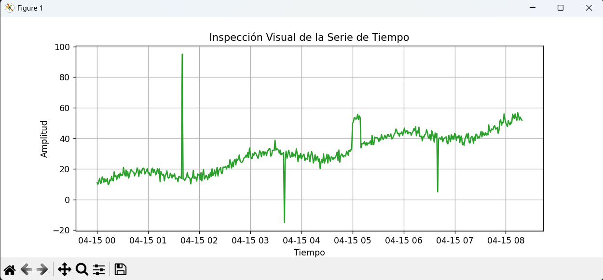

## ANÁLISIS INICIAL DE DATOS: ESTRUCTURA Y COMPORTAMIENTO DE UN DATASET
### Fase 1: Origen de los datos

En el desarrollo de sistemas de Inteligencia Artificial, los datos pueden obtenerse de distintas formas. A continuación, se analizan dos escenarios comunes en ingeniería.

### Caso 1: Obtención a partir de fuentes existentes

En este enfoque, los datos ya se encuentran disponibles en repositorios públicos o institucionales. Un ejemplo es la predicción de la demanda eléctrica en una región, utilizando información de organismos especializados o bases meteorológicas.

Los principales desafíos en este caso son:

Integración de múltiples fuentes de información
Limpieza y transformación de datos
Manejo de valores faltantes
Ajuste de diferentes escalas temporales
Caso 2: Generación de datos mediante instrumentación

En este escenario, los datos no existen previamente, por lo que deben ser generados mediante sensores o dispositivos físicos. Un ejemplo es el análisis térmico de una estructura metálica durante procesos industriales.

Los retos más relevantes incluyen:

Selección adecuada de sensores
Definición de la frecuencia de muestreo
Control del ruido en las mediciones
Asegurar la precisión y confiabilidad de los datos
## Fase 2: Exploración inicial del dataset (EDA)

Antes de aplicar cualquier modelo de aprendizaje automático, es necesario analizar el comportamiento de los datos mediante herramientas estadísticas y visuales.


Generación de datos sin anomalías
```python
import pandas as pd
import matplotlib.pyplot as plt
import seaborn as sns
import numpy as np

np.random.seed(42)
tiempo = pd.date_range(start='2026-04-15', periods=500, freq='T')

valores = np.linspace(10, 50, 500) + np.sin(np.linspace(0, 20, 500))*5 + np.random.normal(0, 2, 500)

df = pd.DataFrame({'Timestamp': tiempo, 'Lectura': valores})
df.set_index('Timestamp', inplace=True)

plt.figure(figsize=(10, 4))
plt.plot(df.index, df['Lectura'])
plt.title("Serie de Tiempo")
plt.xlabel("Tiempo")
plt.ylabel("Lectura")
plt.grid(True)
plt.show()

plt.figure(figsize=(6, 4))
sns.histplot(df['Lectura'], kde=True, bins=30)
plt.title("Distribución de los datos")
plt.show()

print(df.describe())
```
Introducción de anomalías en los datos
```python
df_anom = df.copy()

df_anom.iloc[100, 0] = 95
df_anom.iloc[220, 0] = -15
df_anom.iloc[300:310, 0] += 20
df_anom.iloc[400, 0] = 5

plt.figure(figsize=(10, 4))
plt.plot(df_anom.index, df_anom['Lectura'])
plt.title("Serie de Tiempo con anomalías")
plt.xlabel("Tiempo")
plt.ylabel("Lectura")
plt.grid(True)
plt.show()

plt.figure(figsize=(6, 4))
sns.histplot(df_anom['Lectura'], kde=True, bins=30)
plt.title("Distribución con valores atípicos")
plt.show()

print(df_anom.describe())
```

## Fase 3: Interpretación de resultados
### 1. Naturaleza de la serie de tiempo

La serie analizada no es estacionaria, ya que presenta una tendencia creciente en sus valores a lo largo del tiempo. Además, la variabilidad cambia debido a la presencia de oscilaciones y anomalías.

Esto es relevante porque muchos modelos requieren que las propiedades estadísticas sean constantes. Cuando esto no se cumple, el modelo puede generar interpretaciones incorrectas y reducir su capacidad predictiva.

Para corregir este problema, se pueden aplicar técnicas como:

Normalización
Eliminación de tendencia
Diferenciación
Filtrado de valores atípicos
### 2. Origen de valores atípicos en un sistema real

En un entorno físico, los datos pueden verse afectados por diversos factores externos, tales como:

Interferencias electromagnéticas
Fallas en sensores o conexiones
Vibraciones mecánicas
Cambios ambientales bruscos
Problemas en la alimentación eléctrica
Manipulación humana

Estos factores introducen ruido y afectan la calidad de las mediciones.





### 3. Consecuencias de omitir el análisis exploratorio

Si se omite esta etapa, pueden surgir diversos problemas:

El modelo aprende patrones incorrectos
Se generan predicciones poco confiables
Existe riesgo de sobreajuste
El entrenamiento puede ser inestable
Se pueden tomar decisiones erróneas en sistemas reales
Se desperdician recursos computacionales
## Conclusión

El análisis inicial de los datos es una etapa fundamental en cualquier proyecto de Inteligencia Artificial. Permite identificar problemas, comprender la estructura de la información y preparar los datos adecuadamente.

Trabajar con datos sin analizar puede comprometer seriamente la calidad de los resultados, por lo que esta fase debe considerarse obligatoria antes de aplicar cualquier modelo predictivo.