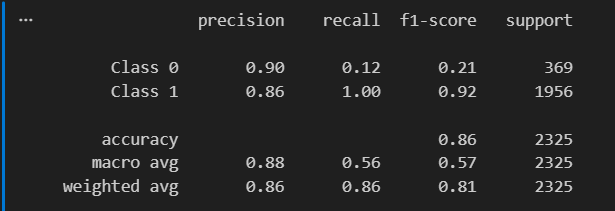
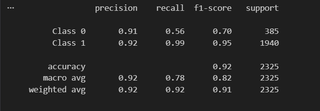
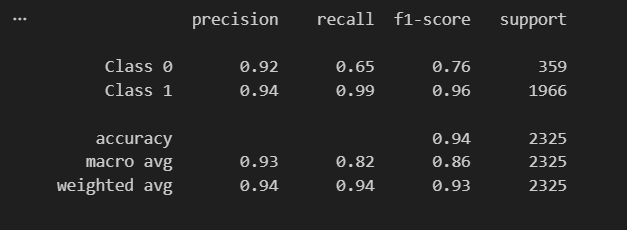
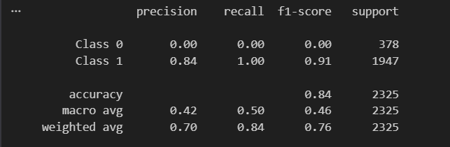
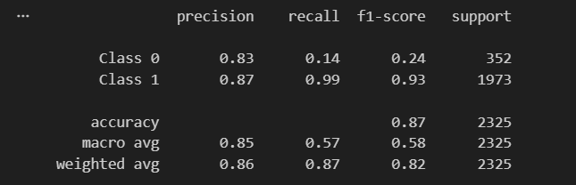
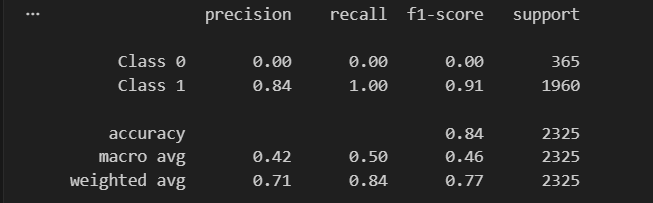
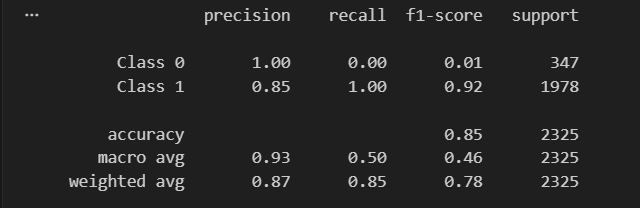

# EVALUACIÓN DE MODELOS CONVOLUCIONALES (CNN)

## Introducción
En esta sección se analizan los resultados obtenidos a partir de múltiples pruebas realizadas con un modelo de redes neuronales convolucionales (CNN). El objetivo es evaluar su desempeño en un problema de clasificación binaria, considerando métricas clave como:
* **Precisión** (*Precision*)
* **Sensibilidad** (*Recall*)
* **F1-score**
* **Exactitud** (*Accuracy*)

A lo largo de las pruebas, se observa el impacto del desbalance de clases y cómo este influye directamente en el comportamiento predictivo del modelo.

---

## Análisis de resultados (Pruebas 1 a 10)

Para facilitar el diagnóstico del modelo, se presenta un resumen del comportamiento del agente en cada iteración:

| Prueba | Estado de la Clase Minoritaria (Clase 0) | Comportamiento General del Modelo |
| :--- | :--- | :--- |
| **Prueba 1** | *Recall* extremadamente bajo. | Sesgado hacia la clase mayoritaria (Clase 1). |
| **Prueba 2** | *Recall* aumenta significativamente. | Mejora la detección de la Clase 0, pero persiste el desequilibrio. |
| **Prueba 3** | Mejora notable en *Recall* y *F1-score*. | **Desempeño equilibrado.** El modelo diferencia mejor ambas clases. |
| **Prueba 4** | No es identificada en absoluto (Falla). | **Colapso del modelo** hacia la clase mayoritaria. |
| **Prueba 5** | *Recall* muy bajo. | Comportamiento desequilibrado; utilidad limitada. |
| **Prueba 6** | Clase ignorada por completo. | Reincidencia en el colapso; clasifica casi todo como Clase 1. |
| **Prueba 7** | Precisión perfecta ($100\%$), pero *Recall* casi nulo. | Modelo extremadamente conservador; rara vez predice la Clase 0. |
| **Prueba 8** | Capacidad de detección muy baja. | Se mantiene el desbalance pese a una buena precisión. |
| **Prueba 9** | Mejora parcial en la detección. | Recuperación progresiva, pero sin un equilibrio óptimo. |
| **Prueba 10** | *Recall* casi nulo. | Regreso a un estado altamente sesgado; ignora la categoría. |

---

## Interpretación general

A partir de la exploración de las 10 pruebas, se identifican los siguientes patrones críticos en el comportamiento de la red:
* **Sesgo sistemático:** El modelo tiende de forma natural a favorecer a la clase mayoritaria.
* **Métricas engañosas:** La precisión de una clase puede mantenerse alta incluso cuando el desempeño general del sistema es deficiente.
* **Vulnerabilidad del *Recall*:** La sensibilidad (*Recall*) es la métrica más afectada y castigada en la clase minoritaria.
* **Evaluación honesta:** El *F1-score* y el promedio macro (*Macro Average*) reflejan con mucha mayor fidelidad el desempeño real del modelo en comparación con el *Accuracy* global.

---

## Problema principal: Desbalance de clases

El análisis estadístico confirma que el obstáculo principal del sistema es el **desbalance de clases**. Este fenómeno provoca un comportamiento errático en la red debido a que:
1. Aprende y prioriza la clase que cuenta con más ejemplos en el dataset.
2. Ignora parcial o totalmente la existencia de la clase minoritaria.
3. Genera resultados falsamente optimistas en métricas globales como el *Accuracy*.

---

## Conclusión

Este análisis demuestra que un modelo de aprendizaje profundo puede aparentar un rendimiento sobresaliente cuando se evalúa únicamente bajo la métrica de *Accuracy*, ocultando una falla crítica en su objetivo principal: clasificar correctamente todas las categorías.

Para solucionar el sesgo y mejorar el desempeño de la CNN en aplicaciones reales, es imperativo aplicar estrategias de ingeniería de datos y modelado tales como:
* **Balanceo del dataset** (mediante técnicas de sobremuestreo como SMOTE o submuestreo).
* **Aumento de datos** (*Data Augmentation*) para enriquecer la clase minoritaria.
* **Ajuste de pesos en la función de pérdida** (*Class Weights* en la *Loss Function*) para penalizar más los errores de la Clase 0.
* **Adopción de métricas representativas** centrándose en el área bajo la curva (*AUC-ROC*) y el *F1-score*.

